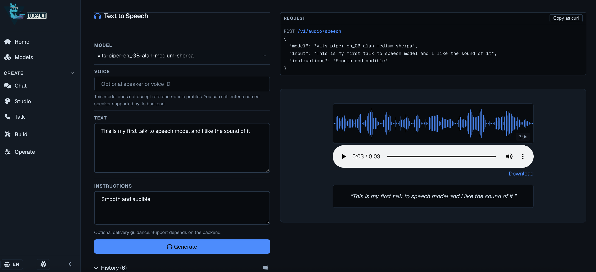

# LocalAI TTS Docker

A local Text-to-Speech deployment using **Docker, LocalAI, Piper VITS and sherpa-onnx**.

## Architecture

```text
Browser / Application
        ↓
     LocalAI
        ↓
   sherpa-onnx
        ↓
    Piper VITS
        ↓
      Audio
```

## Requirements

- Docker Desktop or Docker Engine
- Internet connection for initial downloads
- CPU is sufficient for this model

## 1. Clone the Repository

```bash
git clone <your-repository-url>
cd LocalAI-TTS-Docker
```

## 2. Start LocalAI

```bash
docker compose up -d
```

Check the container:

```bash
docker ps
```

## 3. Open LocalAI

Open:

```text
http://localhost:8080/app
```

## 4. Install the TTS Model

Search the LocalAI model gallery for:

```text
vits-piper-en_GB-alan-medium-sherpa
```

Install the model.

## 5. Test TTS in the Browser

Open the installed model and select:

```text
TTS
```

Enter some text and generate the audio.

## 6. Test TTS Through the API

```bash
curl http://localhost:8080/v1/audio/speech \
  -H "Content-Type: application/json" \
  -d '{
    "model": "vits-piper-en_GB-alan-medium-sherpa",
    "input": "Hello, this is my local text to speech service."
  }' \
  --output test.wav
```

Check the generated audio:

```bash
ls -lh test.wav
```

## Stop LocalAI

```bash
docker compose down
```

Start it again with:

```bash
docker compose up -d
```

## Stack

- Docker
- LocalAI
- Piper VITS
- sherpa-onnx
- REST API


### TTS Running in LocalAI




## Architecture


